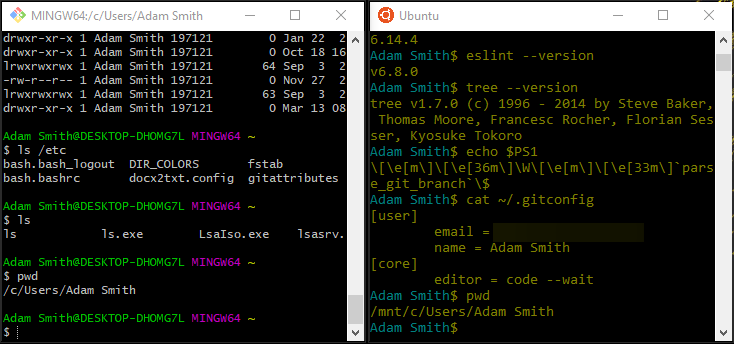

[Introduction](index) • [The Growth Mindset](index#growthmindset) • [Learning Markdown](markdown) • [The Coder's Computer](#)

## Text Editors

Web developers use text editors to write and manage text, including code. While operating systems typically provide basic text editors, third party options that provide the features above can make coding more efficient. Popular third party editors include Sublime, Notepad++, VS Code, Atom, Vim, and UltraEdit. Features that can make coding efficient and comfortable include:

* Syntax highlighting - which displays text in different colors according to the category of terms;
* Code completion - which based on what you start typing, predict and offer suggestions that can be selected;
* Customization of theme - which allow you to choose background and text colors that you find preferable and that might reduce eye strain; and
* Extensions - which allow you to add additional features to your text editor.

Selecting a text editor is a choice based on personal preferences. Programmers often use a text editor within a n Integrated Development Environment (IDE). The IDE includes the text editor along with other tools that support managing files, compiling code, debugging, and deployment.

[TOP](coderscomputer)

## Using a Terminal
Just as a GUI provides a graphical way to interact with a system, the command line, or __terminal__, provides a text-based way to do so. Users enter text commands and can receive feedback also in the form of text.

The terminal allows the user to interact with the __shell__. When commands are typed into the terminal, the shell (part of the OS) interprets the commands so that the operating system can execute them to perform the appropriate functions. Shells include the Bourne shell, the Borne Again shell (BASH), the Korn shell, adn the POSIX shell.

Various __commands__ can be run in the terminal. Often they can include __command line arguments__ that define how the commend is run. For example ls lists the contents of the current directory, whereas ls /etc lists the contents of the specified etc directory.

In linux, _everything is a file_, this includes the keyboard, the monitor, and the mouse. Linux is reading from and writing to files. Linux does not use file extensions to determine a file's type, rather it look into the file itself. 

Basic commands allow us to move up and down the directory tree relative to our current location, or to 'jump' to another location using an absolute path. In the directories we can list the files and sub-directories (__ls__), inspect files to see what type they are (__file__), discover our current location (__pwd__), as well as do things such as creating new files (__touch__).
