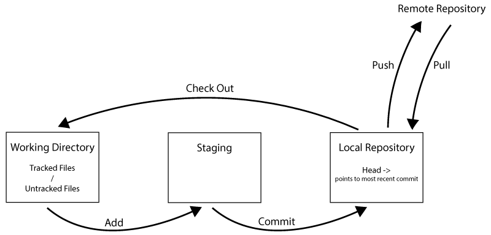

[Home - Table of Contents](index)

## Git
Git is a version control system allowing you to track changes to files, compare changes, and revert to previous versions of files. Git is used by programmers to manage code files.

Centeralized and distributed version control systems allow for collaboration between programmers. In centralized systems, a single server was used to store the files. While allowing collaboration it introduced a single point of failure and data loss. Distributed version control systems store a mirrored repository on each prgrammers client computer which increases data redundancy and enables coders to work even when they can't access the central database.

### How Does Git Work?

Each time a file is committed to the repository, Git creates a *Snapshot* and stores a reference to it. To commit a file in the working directory, it is added to staging, and then committed. Git commands are used in a Terminal or CLE to determine the status of files, change the status of files, and to push changes to and pull changes from a remote repository.

To stage a file for the next commit:
```
git add __filename__
```

To commit the staged snapshot:
```
git commit -m "__message__"
```

To push changes from local repository to remote repository:
```
git push origin master
```
(Note - Origin is default name for the remote, master is a default name for the local master branch.)

To see the current status of files:
```
git status
```