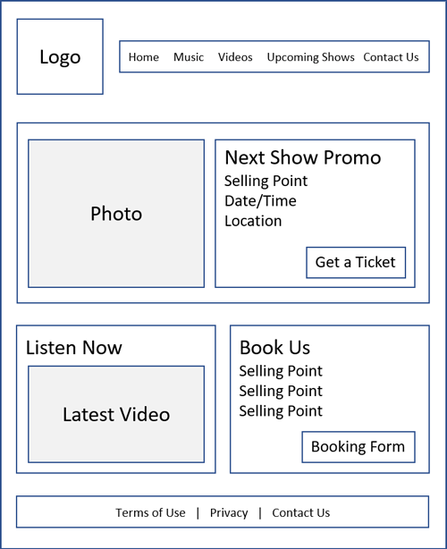
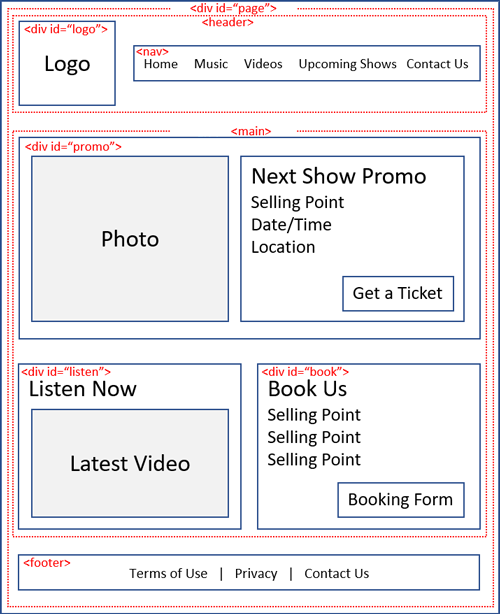

[Home - Table of Contents](index)

## Structure Web Pages with HTML

### Process and Design
Whether it is company or product marketing site or a web application, design begins with clarifying the purpose of the site and if possible, how successful achievement of that purpose can be measured. By establishing metrics up-front, you can test against those - with a real audience if possible - through the development process making adjustments as necessary.

Company and product sites are usually one of set of customer touchpoints that should be designed to function symbiotically. The website needs to perform some functions independently, but it is also integral to delivering on the overarching promise of the brand.

Site design requires determining the intersection between the needs of your targeted users and your business objectives. Who is the site for? How will those targeted people get what they want from your site in a way that contributes to your business goals?

What do those people want to get from the site? What does the business want? What is a fair exchange? How can information and features on the site be organized to make that exchange as frictionless as possible.

Developing personas can help clarify the audience and inform site design, this includes the prioritization of information.

A wireframe can be used to map how that information is organized on the various pages.

This is a wireframe for the homepage of a band website:



### HTML5 Layout
For some time, div's have been used to structure HTML pages. HTML5 includes elements specifically to indicate stucture. For example, where previously a div with id="header" was used, the HTML element <header> may now be use. Other HTML structure elements include <article>, <aside>, and <footer>.

This diagram shows the wireframe of the band website being translated into a HTML definition:



Which is defined like this in HTML (note - styling is required to achieve the visual layout indicated in the wireframe):

```
<html>
    <head>
    </head>
    <body>
        <div id="page">
            <header>
                <div id="logo">
                    
                </div><!--logo-->
                <nav>
                    <ul>
                        <li><a href="index.html">Home</a></li>
                        <li><a href="music.html">Music</a></li>
                        <li>Videos</li>
                        <li>Upcoming Shows</li>
                        <li>Contact Us</li>
                    </ul>
                </nav>
            </header>
            <main>
                <div id="promo">
                    
                    <h2>Next Show Promo</h2>
                    <p>Selling Point</p>
                    <p>Date/Time</p>
                    <p>Location</p>
                    <button>Get a Ticket</button>
                </div><!--promo-->
                <div id="listen">
                    <h2>Listen Now</h2>
                    <iframe width="560" height="315"
                    src="https://www.youtube.com/embed/D-_XSmla7nc" 
                    frameborder="0" allow="accelerometer; autoplay; 
                    encrypted-media; gyroscope; picture-in-picture" 
                    allowfullscreen></iframe>
                </div><!--listen-->
                <div id="book">
                    <h2>Book Us</h2>
                    <p>Selling Point</p>
                    <p>Selling Point</p>
                    <p>Selling Point</p>
                    <button>Booking Form</button>
                </div><!--book-->
            </main>
            <footer>
                <ul>
                    <li>Terms of Use</li>
                    <li>Privacy</li>
                    <li>Contact Us</li>
                </ul>
            </footer>
        </div><!--page-->
    </body>
</html>
```

